:scrollbar:
:toc2:
:dmn_github: link:https://github.com/gpe-mw-training/bxms_decision_mgmt_foundations_lab/tree/master/dmn[DMN GitHub repository]
:gitHub_repo: link:https://github.com/gpe-mw-training/bxms_decision_mgmt_foundations_lab[GitHub repository]
:business_central: link:https://localhost:8080/business-central[Business Central]
:openshift_master: link:https://console-openshift-console.apps-crc.testing/[OpenShift Master]
:kie_server: link:https://localhost:8080/kie-server[KIE Server]
:linkattrs:

== Kogito Advanced

In this advanced Kogito lab, we will deploy an advanced, multi-service, Kogito application, including Kogito support services and infrastructure.
We will add persistence with Infinispan, messaging with Kafka and data-indexing and search with GraphQL

.Goals
* Deploy an advanced Kogito application, including supporting services and infrastructure.

.Prerequisite
* Visual Studio Code: https://code.visualstudio.com/
* Kogito Tooling Visual Studio Code: https://github.com/kiegroup/kogito-tooling/releases
* OpenShift 4.x environment.
* OpenShift `oc` client.
* Kogito CLI: https://github.com/kiegroup/kogito-cloud-operator/releases
* Git client
* JDK 11
* Maven 3.5.x+: https://maven.apache.org
* GraalVM (optional): https://www.graalvm.org/


== Problem Statement
The goal is to create a full Kogito enterprise environment in OpenShift.

* Deploy Kogito infrastructure (Infinispan, Kafka) using the Kogito Operator and CLI.
* Deploy Kogito application and service definitions using the Kogito CLI.
* Use OpenShift Binary Builds to push Kogito services to OpenShift.

== OpenShift Environment
To complete this guide, you will need to have access to an OpenShift environment in which either:

. you have _cluster admin_ rights, or
. the Kogito Operator is already installed in a namespace accessible to you.

The reason is that in order to install _Operators_ on OpenShift, you need to have _cluster admin_ rights.

You can use different types of OpenShift 4.x environments, like a full OpenShift cluster, or a small [CodeReady Containers](https://github.com/code-ready/crc) environment.
The OpenShift environment needs to have access to the outside world in order to be able to pull in the required container images and build artefacts.

First, we need to login to the OpenShift environment, both via the web console and via the `oc` command line client.

. Navigate to your OpenShift Master console and login with your credentials.
. In the upper-right corner of the console, click on your username. In the dropdown, click on _Copy Login Command_.
. Provide your username and password again, and in the next screen, click on _Display Token_.
. Copy the `oc` login command, and run it in a terminal: `oc login --token={openshift_token} --server=https://{openshift_master}`

Depending on whether you've cluster admin rights or not, you either:

- Create a new project and install the Kogito Operator.
- Connect to the project that has the Kogito Operator installed.

If you don't have _cluster admin_ rights, and have access to a project with the Kogito Operator installed, continue with the _Open the Kogito project_ section.

== Install the Kogito Operator

The Kogito Operator can be installed via either the _Operator Hub_ in the OpenShift Console, or via the Kogito CLI. In this guid we will be using the Kogito CLI.

=== Installing the Operator with the Kogito CLI

To install the Kogito Operator, we first need to create a project/namespace in OpenShift in which we will install our Operator and application.
You can do this either from the OpenShift console or with the `oc` client. In this guide we will use the `oc` client.

. In a terminal, with the `oc` client connected to your OpenShift environment, issue the following command to create a new project: `oc new-project kogito-travel-agency --display-name="Kogito Travel Agency" --description="Kogito Travel Agency application."`
. Make sure your `kogito` tooling is using our new project. Issue the following command: `kogito use-project`. This should return: _Project set to 'kogito-travel-agency'_. If this is not the case, issue the command: `kogito use-project kogito-travel-agency`
. The `kogito use-project` command will also automatically install the:
.. Kogito Operator:
.. Infinispan Operator: provides persistence infrastructure to Kogito applications and support services.
.. Strimzi Operator: provides messaging infrastructure to Kogito applications.
.. Keycload Operator: provides security and single-sign-on infrastructure to Kogito applications.
. The Kogito Operator can also be installed with the command: `kogito install operator`

Navigate to your OpenShift console. Open the project you've created. In the left-hand side of the screen, click on _Operators -> Install Operators_. The Operators will be listed:

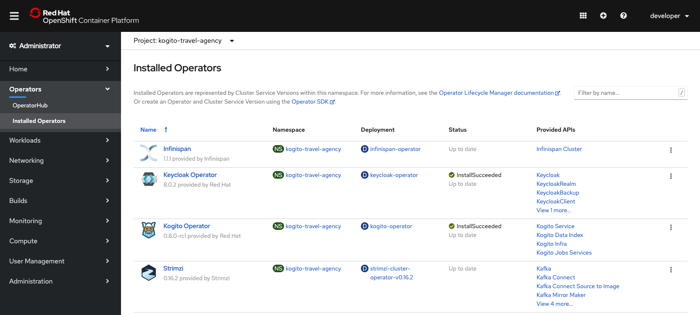

== Open the Kogito project

If you don't have _cluster admin_ rights on your OpenShift instance, a project with the Kogito Operator (and the Operators it depends on) should be provided to you.
Say that this project is called `kogito-travel-agency`

. In a terminal, with the `oc` client connected to your OpenShift instance, open your project with the command: `oc project kogito-travel-agency`.
. Make sure your `kogito` tooling is using our new project. Issue the following command: `kogito use-project`. This should return: _Project set to 'kogito-travel-agency'_. If this is not the case, issue the command: `kogito use-project kogito-travel-agency`


== Installing Infinispan persistence

Kogito persistence is built on-top of the NoSQL key/value store paradigm. By defaul, Kogito services and support services use [Infinispan](https://infinispan.org/) as their persistence provider.
The Kogito Operator depends on, and user, the Infinispan Operator to deploy and manage the Infinispan infrastructure in the Kogito project.

The Infinispan infrastructure can be installed both from the Kogito Operator UI in the OpenShift Console and the `kogito` client. In this guide, we will be using the `kogito` client.

. From a terminal, install the Infinispan infrastructure using the command: `kogito install infinispan`
. Navigate to the Kogito Operator in the OpenShift console. A new `kogito-infra` CR (Custom Resource) will be created:
+
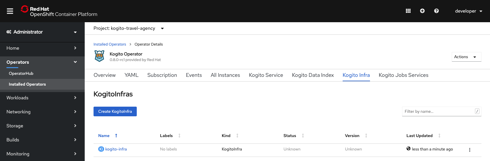
+
. If we navigate to the Infinispan Operator in the OpenShift Console, we can see the `kogito-infispan` Infinispan CR, which defines the Infispan cluster:
+

+
. Under _Workloads -> Stateful Sets_, the `kogito-infinispan` _Stateful Set_ is deployed.
+
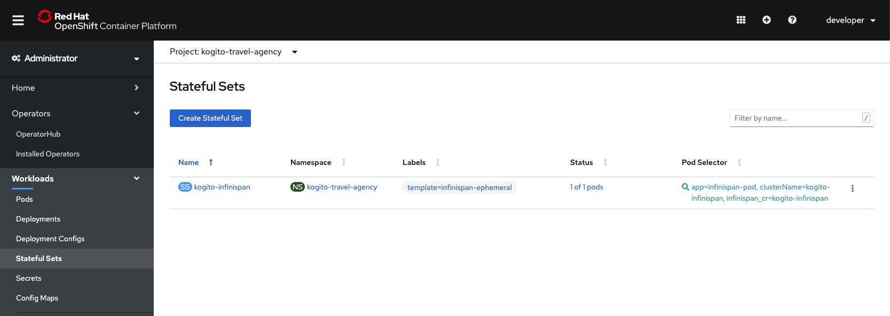

With the persistence infrastructure deployed, we can continue with the messaging infrastructure

== Installing Kafka messaging.

Kogito services and support services are built on [Quarkus](https://quarkus.io/) (note Kogito services can also be built on top of SpringBoot), and as such use MicroProfile Reactive Messaging specification for messaging.
By default Kogito uses [Apache Kafka](https://kafka.apache.org/) as the messaging provider. The Kogito Operator depends on, and uses, the [Strimzi](https://strimzi.io/) Operator to deploy and manage the Kafka infrastructure in the Kogito project.

The Kafka infrastructure can be installed both from the Kogito Operator UI in the OpenShift Console and the `kogito` client. In this guide, we will use the `kogito` client.

. From a terminal, install the Kafka infrastructure with the command: `kogito install kafka`
. Navigate to the Kogito Operator in the OpenShift console. Navigate to the _Kogito Infra_ tab. Click on the `kogito-infra` CR, and observe that the _Install Kafka_ switch is enabled. I.e. the Kogito Kafka management resides in the same `KogitoInfra` _Custom Resource_ as the Kogito Infispan infra.
+
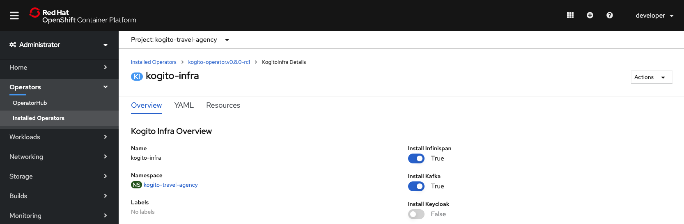
+
. Navigate to the Strimzi Operator in the OpenShift Console. Observe the `kogito-kafka` CR instance:
+
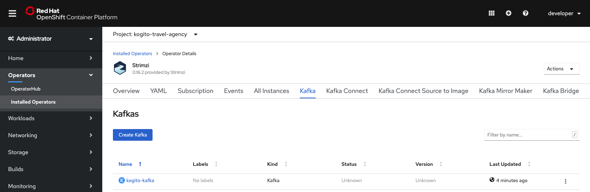
+
. Under _Workloads -> Stateful Sets_ we can see the Kafka and Kafka Zookeeper stateful sets deployed:
+
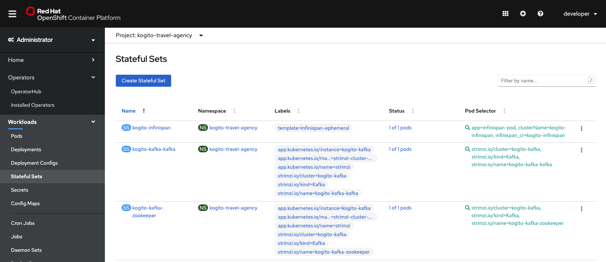

With the infrastructure deployed, we can now deploy the Kogito Support Services, in particular the Data Index Service.


== Installing the Data Index Service

The Kogito Data Index Service is responsible for storing all Kogito events related to processes, tasks and domain data. It operates by consuming messages from various Kafka topics, indexing them and storing them into the Infinispan persistence store.
The Data Index Service provides the back bone for all of the Kogito search, insight and management capabilities.

The Data Index Service can be installed both from the Kogito Operator UI in the OpenShift Console and the `kogito` client. In this guide we will use the `kogito` client.

. From a terminal, install the Kogito Data Index Service with the command: `kogito install data-index -e KOGITO_PROTOBUF_WATCH=true`
. The response in the terminal states that, because no Infinispan and Kafka information was provided in the command, the required Infinispan and Kafka infrastructure will be automatically deployed if it does not yet exist. However, since we've already deployed this infrastructure, the Kogito Operator will make sure that the Data Index Service is provisioned with the configuration settings required to connect to our existing infrastructure.
+
NOTE: It would have been possible to deploy the entire Kogito Infrastructure by simply deploying the Kogito Data Index Service. However, in this guide we want to be explicit and show you all of the individual components, and their management commands, that build up a Kogito application.
+
. Navigate to the Kogito Operator in the OpenShift console. Navigate to the _Kogito Data Index_ tab. Click on the `kogito-infra` CR, and observe that the _Install Kafka_ switch is enabled. I.e. the Kogito Kafka management resides in the same `KogitoInfra` _Custom Resource_ as the Kogito Infispan infra.
+
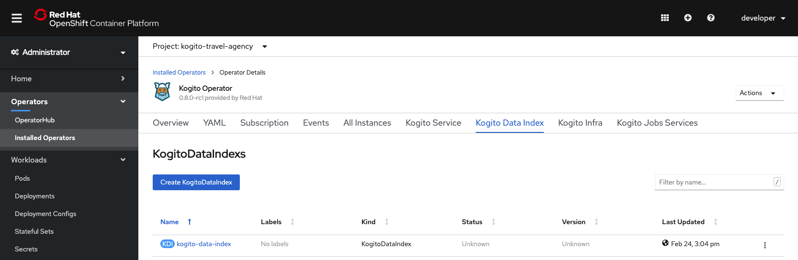
+
. Navigate to _Workloads -> Deployments_ and observe the deployed Data Index Service:
+
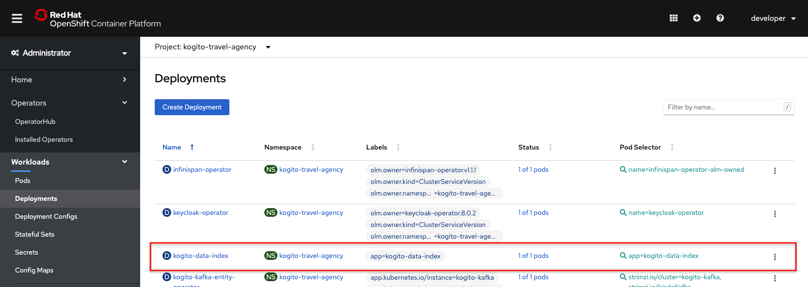
+
. Navigate to _Networking -> Routes_. Observe the `kogito-data-index` route.
+
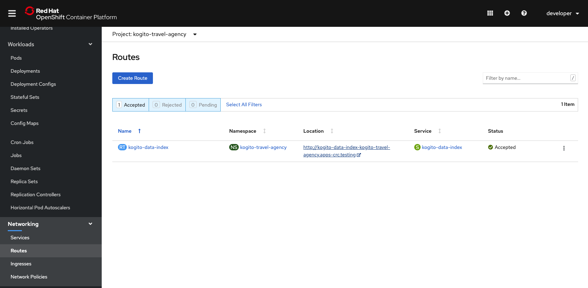
+
. Click on the URL in the _Location_ column of the `kogito-data-index` route, which brings you to the Kogito Data Index Service Graph_i_QL interface.
+
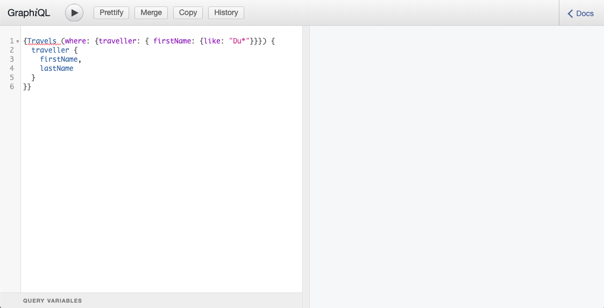

We have now deployed the full infrastructure required to run our Kogito Travel Agency application, we can now build and deploy our services.


== Cloning the Kogito Travel Agency application.

The Kogito Travel Agency application is available on Github: https://github.com/kiegroup/kogito-travel-agency-tutorial

The application is comprised of 2 Kogito services/applications:

- Travel Agency: the application in which you book a travel
- Visas: the application in which a visa, if required, is managed

These 2 services expose RESTful APIs, which are fully generated from the project's business assets (BPMN2 process definitions in this case).
Internally they communicate via messaging, in particular Apache Kafka. Also the logic to interact with Kafka to produce and consume messages is fully generated from the BPMN2 process definitions.

To work with the Kogito Travel Agency application and deploy it into our `kogito-travel-agency` project in OpenShift, we first need to clone it to our local system.

. In a terminal, move to a directory in which you would like to clone and store the Kogito Travel Agency application.
. Execute the following command to clone the repository to your local filesystem: `git clone https://github.com/kiegroup/kogito-travel-agency-tutorial.git`

The cloned repository contains a number of different projects, each of them increasing in complexity. In this guide, we will be using the projects `06-kogito-travel-agency` and `06-kogito-visas`, as these are the most ellaborate.


== Creating the Kogito Services

To deploy our Kogito application to OpenShift, we can again use the Kogito Operator to provision the OpenShift resources our application requires:

. BuildConfig:
.. In this guide we will be using a Binary Build, a build in which we locally build the application and push the built application to the OpenShift Build to be packaged into the runtime container image.
.. Kogito also supports S2I, or Source-to-Image, builds, which build the application in a Build on OpenShift and then pass the built application to the next OpenShift build to be packaged into the runtime container image.
. ImageStream: an image stream comprises one or more container images identified by tags.
. DeploymentConfig: describes the desired state of a of the Kogito application application as a Pod template.
. Service: a Kubernetes internal load-balancer to serve the application Pods.
. Route: exposes the Service at a hostname.

To deploy a Kogito service/applicatio that supports binary builds, we can again use the Kogito Operator.

**TODO** Finish this section when binary builds are supported in the operator.
. In a terminal, create a new Kogito Service for the `kogito-travel-agency` application using the following command: `kogito deploy-service kogito-travel-agency ...........    `
. Navigate to the Kogito Operator in the OpenShift console. Navigate to the _Kogito Service_ tab. Click on the `kogito-travel-agency` CR.
. Navigate to _Builds -> Build Configs_, observe that a new `kogito-travel-agency` `BuildConfig` has been created.
. Go back to the terminal, and create a new Kogito Service for the `kogito-visas` application with the following command: `kogit deploy-service kogito-visas .......`
. Navigate to the Kogito Operator in the OpenShift console. Navigate to the _Kogito Service_ tab. Click on the `kogito-visas` CR.
. Navigate to _Builds -> Build Configs_, observe that a new `kogito-visas` `BuildConfig` has been created.

Note that the Operator will dynamically create the `DeploymentConfig`, `Service` and `Route` for our applications when their first build has successfully completed.

## Building the projects

Before we can deploy our application onto OpenShift, we first need to compile and build the binaries.

NOTE: Kogito provides a S2I, or Source-to-Image, build configuration that allows one to build the project directly from a Git repository on the OpenShift platform itself.
In this guide however, we will be building our project locally to show the _developer experience_ of working with a Kogito project on a development machine and pushing to the cloud.

Since the Kogito Travel Agency application is built on Quarkus, we provide 2 ways in which we can build and compile the project:

. JDK-mode: This is a standard Maven build, and will package the application as a _runner_ JAR and its dependencies (stored in a _libs_ folder)
. Native-mode: This mode requires the GraalVM and SubstrateVM frameworks to build and compile the application into a native executable for your system.

In this guide we will use the JDK-mode as the standard build mode. In the extra section of this guide we will discuss how to compile native executables of the application that are suitable for cloud deployments.

### Kogito Travel Agency Application

. Navigate to the `06-kogito-travel-agency` directory: `cd 06-kogito-travel-agency`
. Build the project using Maven with the following command: `mvn clean package`
. Inspect the `target` folder that has been created: `ls target` (Linux/macOS) or `dir target` (Windows)

You should see the following output:

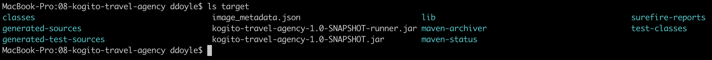

The directory contains, among other things:

. `kogito-travel-agency-1.0-SNAPSHOT.jar`: containing just the classes and resources of the projects, it’s the regular artifact produced by the Maven build.
. `kogito-travel-agency-1.0-SNAPSHOT-runner.jar`: being an executable jar. Be aware that it’s not an über-jar as the dependencies are copied into the `target/lib` directory.
. `lib`: directory containing the project dependencies.

We will send the _runner_ JAR and the library directory to the Kogito Travel Agency Binary Build on OpenShift.

. Prepare for a binary build of the `kogito-travel-agency` application on OpenShift. On your local machine, create a `kogito-travel-agency` directory in, for example, your temporary folder. This would be `/tmp/kogito-travel-agency` on Linux or macOS:
+
```
mkdir /tmp/kogito-travel-agency
```
+
. Copy the executable application JAR, the runner JAR, and the lib folder of your application to the directory.
+
```
$ cp -r target/kogito-travel-agency-1.0-SNAPSHOT-runner.jar target/lib /tmp/kogito-travel-agency
```
+
. Deploy the application to OpenShift:
+
```
$ oc start-build kogito-travel-agency --from-dir=/tmp/kogito-travel-agency
Output
Uploading directory "/tmp/kogito-travel-agency" as binary input for the build ...
....
Uploading finished
build.build.openshift.io/kogito-travel-agency-1 started
```
+
. Check the logs of the builder pod:
+
```
$ oc logs -f build/kogito-travel-agency-1
```
+
. Once your binary build is finished, it will push the result to the `kogito-travel-agency` ImageStream (the ImageStream that was created by the Operator), which will trigger a new deployment.
. Navigate to _Workloads -> Deployment Configs -> kogito-travel-agency_, Observe that a new deployment is being provisioned.
. Navigate to _Networking -> Routes_. Click on the URL in the Location column of the `kogito-travel-agency`, which will bring you to the main page of the Kogito Travel Agency application.
+
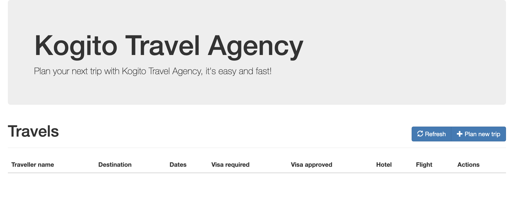


**TODO** SHOULD WE ADD A DESCRIPTION ON HOW TO GET THE ROUTES VIA THE COMMAND LINE???

. When the *builder* build and *application* build have finished, the Deployment Config has been created and the Pod is up and running, retrieve the route to you Kogito Travel Agency application with the following command (you can also find the route via the OpenShift Console if you ):
+
```
$ oc get route
NAME                   HOST/PORT                                                                                             PATH   SERVICES               PORT   TERMINATION   WILDCARD
kogito-travel-agency   kogito-travel-agency-kogito-operator-lab-user1.apps.cluster-rdam-4a35.rdam-4a35.example.opentlc.com          kogito-travel-agency   http                 None
```
+
. Access the Kogito application deployed on OpenShift using your browser. You should see the same screen as the one you saw when you access the application locally.
+
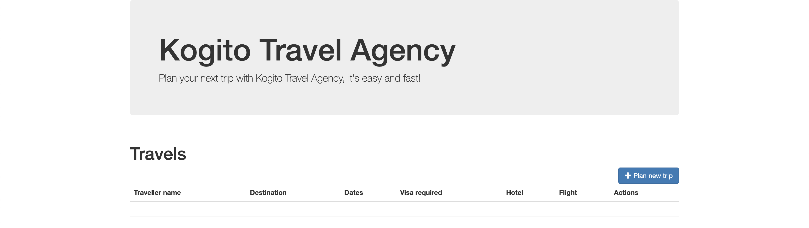


### Kogito Visas Application

We can now do the same for the `kogito-visas` application.

. Navigate to the `06-kogito-visas` directory: `cd 06-kogito-visas`
. Build the project using Maven with the following command: `mvn clean package`
. Prepare for a binary build of the `kogito-visas` application on OpenShift. On your local machine, create a `kogito-visas` directory in, for example, your temporary folder. This would be `/tmp/kogito-visas` on Linux or macOS:
+
```
mkdir /tmp/kogito-visas
```
+
. Copy the executable application JAR, the runner JAR, and the lib folder of your application to the directory.
+
```
$ cp -r target/kogito-visas-1.0-SNAPSHOT-runner.jar target/lib /tmp/kogito-visas
```
+
. Deploy the application to OpenShift:
+
```
$ oc start-build kogito-visas --from-dir=/tmp/kogito-visas
Output
Uploading directory "/tmp/kogito-visas" as binary input for the build ...
....
Uploading finished
build.build.openshift.io/kogito-visas-1 started
```
+
. Check the logs of the builder pod:
+
```
$ oc logs -f build/kogito-visas-1
```
+
. Once your binary build is finished, it will push the result to the `kogito-visas` ImageStream (the ImageStream that was created by the Operator), which will trigger a new deployment.
. Navigate to _Workloads -> Deployment Configs -> kogito-visas_, Observe that a new deployment is being provisioned.
. Navigate to _Networking -> Routes_. Click on the URL in the Location column of the `kogito-visas`, which will bring you to the main page of the Kogito Travel Agency application.
+
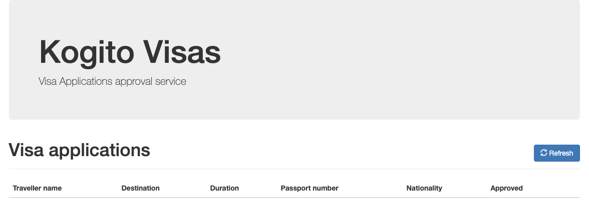


. Create a new Travel using the Kogito Travel Agency application WEB-UI, or send a RESTful request using cURL, for example like this:
+
```
{
   "traveller":{
      "firstName":"Jan",
      "lastName":"Kowalski",
      "email":"jan@email.com",
      "nationality":"Polish",
      "address":{
         "street":"Polna",
         "city":"Krakow",
         "zipCode":"32-000",
         "country":"Poland"
      }
   },
   "trip":{
      "country":"US",
      "city":"New York",
      "begin":"2019-11-04T00:00:00.000+02:00",
      "end":"2019-11-07T00:00:00.000+02:00"
   }
}
