:scrollbar:
:toc2:
:dmn_github: link:https://github.com/gpe-mw-training/bxms_decision_mgmt_foundations_lab/tree/master/dmn[DMN GitHub repository]
:gitHub_repo: link:https://github.com/gpe-mw-training/bxms_decision_mgmt_foundations_lab[GitHub repository]
:business_central: link:https://localhost:8080/business-central[Business Central]
:openshift_master: link:https://console-openshift-console.apps-crc.testing/[OpenShift Master]
:kie_server: link:https://localhost:8080/kie-server[KIE Server]
:linkattrs:

== Kogito Advanced

In this advanced Kogito lab, we will deploy an advanced, multi-service, Kogito application, including Kogito support services and infrastructure.
We will add persistence with Infinispan, messaging with Kafka and data-indexing and search with GraphQL

.Goals
* Deploy an advanced Kogito application, including supporting services and infrastructure.

.Prerequisite
* Visual Studio Code: https://code.visualstudio.com/
* Kogito Tooling Visual Studio Code: https://github.com/kiegroup/kogito-tooling/releases
* OpenShift 4.x environment.
* OpenShift `oc` client.
* Kogito CLI: https://github.com/kiegroup/kogito-cloud-operator/releases
* Git client
* JDK 11
* Maven 3.5.x+
* GraalVM (optional)


== Problem Statement
The goal is to create a full Kogito enterprise environment in OpenShift.

* Deploy Kogito infrastructure (Infinispan, Kafka) using the Kogito Operator and CLI.
* Deploy Kogito application and service definitions using the Kogito CLI.
* Use OpenShift Binary Builds to push Kogito services to OpenShift.

== OpenShift Environment
To complete this guide, you will need to have access to an OpenShift environment in which either:

. you have _cluster admin_ rights, or
. the Kogito Operator is already installed in a namespace accessible to you.

The reason is that in order to install _Operators_ on OpenShift, you need to have _cluster admin_ rights.

You can use different types of OpenShift 4.x environments, like a full OpenShift cluster, or a small [CodeReady Containers](https://github.com/code-ready/crc) environment.
The OpenShift environment needs to have access to the outside world in order to be able to pull in the required container images and build artefacts.

First, we need to login to the OpenShift environment, both via the web console and via the `oc` command line client.

. Navigate to your OpenShift Master console and login with your credentials.
. In the upper-right corner of the console, click on your username. In the dropdown, click on _Copy Login Command_.
. Provide your username and password again, and in the next screen, click on _Display Token_.
. Copy the `oc` login command, and run it in a terminal: `oc login --token={openshift_token} --server=https://{openshift_master}`

Depending on whether you've cluster admin rights or not, you either:

- Create a new project and install the Kogito Operator.
- Connect to the project that has the Kogito Operator installed.

If you don't have _cluster admin_ rights, and have access to a project with the Kogito Operator installed, continue with the _Open the Kogito project_ section.

== Install the Kogito Operator

The Kogito Operator can be installed via either the _Operator Hub_ in the OpenShift Console, or via the Kogito CLI. In this guid we will be using the Kogito CLI.

=== Installing the Operator with the Kogito CLI

To install the Kogito Operator, we first need to create a project/namespace in OpenShift in which we will install our Operator and application.
You can do this either from the OpenShift console or with the `oc` client. In this guide we will use the `oc` client.

. In a terminal, with the `oc` client connected to your OpenShift environment, issue the following command to create a new project: `oc new-project kogito-travel-agency --display-name="Kogito Travel Agency" --description="Kogito Travel Agency application."`
. Make sure your `kogito` tooling is using our new project. Issue the following command: `kogito use-project`. This should return: _Project set to 'kogito-travel-agency'_. If this is not the case, issue the command: `kogito use-project kogito-travel-agency`
. The `kogito use-project` command will also automatically install the:
.. Kogito Operator:
.. Infinispan Operator: provides persistence infrastructure to Kogito applications and support services.
.. Strimzi Operator: provides messaging infrastructure to Kogito applications.
.. Keycload Operator: provides security and single-sign-on infrastructure to Kogito applications.
. The Kogito Operator can also be installed with the command: `kogito install operator`

Navigate to your OpenShift console. Open the project you've created. In the left-hand side of the screen, click on _Operators -> Install Operators_. The Operators will be listed:

image:images/kogito-travel-agency-project-with-operators.png[]

== Open the Kogito project

If you don't have _cluster admin_ rights on your OpenShift instance, a project with the Kogito Operator (and the Operators it depends on) should be provided to you.
Say that this project is called `kogito-travel-agency`

. In a terminal, with the `oc` client connected to your OpenShift instance, open your project with the command: `oc project kogito-travel-agency`.
. Make sure your `kogito` tooling is using our new project. Issue the following command: `kogito use-project`. This should return: _Project set to 'kogito-travel-agency'_. If this is not the case, issue the command: `kogito use-project kogito-travel-agency`


== Installing Infinispan persistence

Kogito persistence is built on-top of the NoSQL key/value store paradigm. By defaul, Kogito services and support services use [Infinispan](https://infinispan.org/) as their persistence provider.
The Kogito Operator depends on, and user, the Infinispan Operator to deploy and manage the Infinispan infrastructure in the Kogito project.

The Infinispan infrastructure can be installed both from the Kogito Operator UI in the OpenShift Console and the `kogito` client. In this guide, we will be using the `kogito` client.

. From a terminal, install the Infinispan infrastructure using the command: `kogito install infinispan`
. Navigate to the Kogito Operator in the OpenShift console. A new `kogito-infra` CR (Custom Resource) will be created:
+
image:images/kogito-install-infinispan.png[]
+
. If we navigate to the Infinispan Operator in the OpenShift Console, we can see the `kogito-infispan` Infinispan CR, which defines the Infispan cluster:
+
image:images/kogito-install-infinispan.png[]
+
. Under _Workloads -> Stateful Sets_, the `kogito-infinispan` _Stateful Set_ is deployed.
+
image:images/kogito-stateful-sets-infinispan.png[]

With the persistence infrastructure deployed, we can continue with the messaging infrastructure

== Installing Kafka messaging.

Kogito services and support services are built on [Quarkus](https://quarkus.io/) (note Kogito services can also be built on top of SpringBoot), and as such use MicroProfile Reactive Messaging specification for messaging.
By default Kogito uses [Apache Kafka](https://kafka.apache.org/) as the messaging provider. The Kogito Operator depends on, and uses, the [Strimzi](https://strimzi.io/) Operator to deploy and manage the Kafka infrastructure in the Kogito project.

The Kafka infrastructure can be installed both from the Kogito Operator UI in the OpenShift Console and the `kogito` client. In this guide, we will use the `kogito` client.

. From a terminal, install the Kafka infrastructure with the command: `kogito install kafka`
. Navigate to the Kogito Operator in the OpenShift console. Navigate to the _Kogito Infra_ tab. Click on the `kogito-infra` CR, and observe that the _Install Kafka_ switch is enabled. I.e. the Kogito Kafka management resides in the same `KogitoInfra` _Custom Resource_ as the Kogito Infispan infra.
+
image:images/kogito-infra-install-kafka.png[]
+
. Navigate to the Strimzi Operator in the OpenShift Console. Observe the `kogito-kafka` CR instance:
+
image:images/kogito-strimzi-kogito-kafka-cr.png[]
+
. Under _Workloads -> Stateful Sets_ we can see the Kafka and Kafka Zookeeper stateful sets deployed:
+
image:images/kogito-stateful-sets-kafka.png[]

With the infrastructure deployed, we can now deploy the Kogito Support Services, in particular the Data Index Service.


== Installing the Data Index Service

The Kogito Data Index Service is responsible for storing all Kogito events related to processes, tasks and domain data. It operates by consuming messages from various Kafka topics, indexing them and storing them into the Infinispan persistence store.
The Data Index Service provides the back bone for all of the Kogito search, insight and management capabilities.

The Data Index Service can be installed both from the Kogito Operator UI in the OpenShift Console and the `kogito` client. In this guide we will use the `kogito` client.

. From a terminal, install the Kogito Data Index Service with the command: `kogito install data-index`
. The response in the terminal states that, because no Infinispan and Kafka information was provided in the command, the required Infinispan and Kafka infrastructure will be automatically deployed if it does not yet exist. However, since we've already deployed this infrastructure, the Kogito Operator will make sure that the Data Index Service is provisioned with the configuration settings required to connect to our existing infrastructure.
+
NOTE: It would have been possible to deploy the entire Kogito Infrastructure by simply deploying the Kogito Data Index Service. However, in this guide we want to be explicit and show you all of the individual components, and their management commands, that build up a Kogito application.
+
. Navigate to the Kogito Operator in the OpenShift console. Navigate to the _Kogito Data Index_ tab. Click on the `kogito-infra` CR, and observe that the _Install Kafka_ switch is enabled. I.e. the Kogito Kafka management resides in the same `KogitoInfra` _Custom Resource_ as the Kogito Infispan infra.
+
image:images/kogito-operator-data-index-cr.png[]
+
. Navigate to _Workloads -> Deployments_ and observe the deployed Data Index Service:
+
image:images/kogito-data-index-deployments.png[]
+
. Navigate to _Networking -> Routes_. Observe the `kogito-data-index` route.
+
image:images/kogito-data-index-route.png[]
+
. Click on the URL in the _Location_ column of the `kogito-data-index` route, which brings you to the Kogito Data Index Service Graph_i_QL interface.
+
image:images/kogito-data-graphiql-interface.png[]

We have now deployed the full infrastructure required to run our Kogito Travel Agency application, we can now build and deploy our services.


== Cloning the Kogito Travel Agency application.

The Kogito Travel Agency application is available on Github: https://github.com/kiegroup/kogito-travel-agency-tutorial

The application is comprised of 2 Kogito services/applications:

- Travel Agency: the application in which you book a travel
- Visas: the application in which a visa, if required, is managed

These 2 services expose RESTful APIs, which are fully generated from the project's business assets (BPMN2 process definitions in this case).
Internally they communicate via messaging, in particular Apache Kafka. Als the logic to interact with Kafka to produce and consume messages is fully generated from the BPMN2 process definitions.

To work with the Kogito Travel Agency application and deploy it into our `kogito-travel-agency` project in OpenShift, we first need to clone it to our local system.

. In a terminal, move to a directory in which you would like to clone and store the Kogito Travel Agency application.
. Execute the following command to clone the repository to your local filesystem: `git clone https://github.com/kiegroup/kogito-travel-agency-tutorial.git`

The cloned repository contains a number of different projects, each of them increasing in complexity. In this guide, we will be using the projects `06-kogito-travel-agency` and `06-kogito-visas`, as these are the most ellaborate.

## Building the projects


== Setting up your Repository

In this lab we will be using the _Kogito Travel Agency Tutorial_ as our base application. We will start with the base application and gradually add functionality to it while we're adding more infrastructure components.
As such, we will fork the _Kogito Travel Agency Tutorial_ in our own personal GitHub, which we can then use as our base application.

. Open the https://github.com/rhba-enablement/kogito-travel-agency-tutorial[Kogito Travel Agency Tutorial GitHub page].
. Fork the repository into your own GitHub.
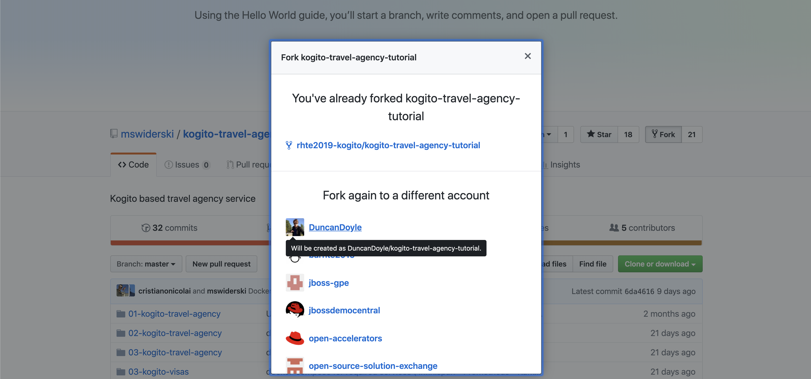
. Clone the GitHub repository to your local filesystem.
+
```
$ git clone git@github.com:{your_github_account}/kogito-travel-agency-tutorial.git
```
+

In this lab, we will use a branch in our repository in which we will make our modifications. This allows you to keep the `master` branch of your repo in sync with the repository you forked from at a later point in time (if needed).

. Create a new branch in your `kogito-travel-agency-tutorial` repository with the name `enablement`
+
```
$ git checkout -b enablement
```
+
. Push this branch to your GitHub repository.
+
```
$ git push -u origin enablement
```
+
. Open your Visual Studio Code IDE (make sure to use https://code.visualstudio.com/updates/v1_39[Visual Studio Code v1.39]) and import the `01-kogito-travel-agency` project of the repository we just cloned into our workspace.
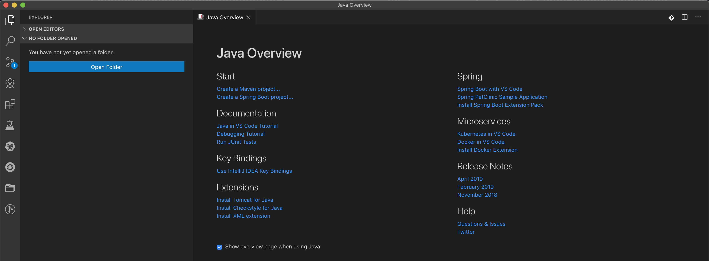
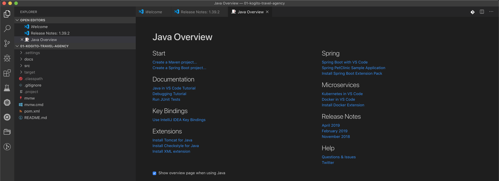
. In VSCode, open a new integrated terminal (the command window can be opened with _Commend + Shift + P_, or by opening the *Command Palette...* view via the menu).
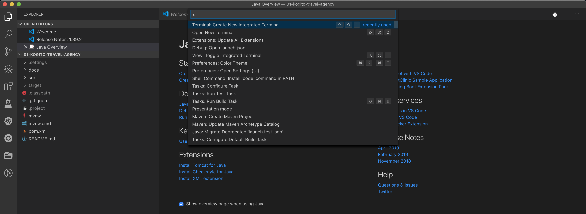
. In the integrated terminal, run the `Kogito Travel Agency` application in _Quarkus dev-mode_ using the following Maven command. This will start the Kogito application in _dev-mode_, with hot-reload capabilities enabled.
+
```
$ mvn clean compile quarkus:dev
```
+
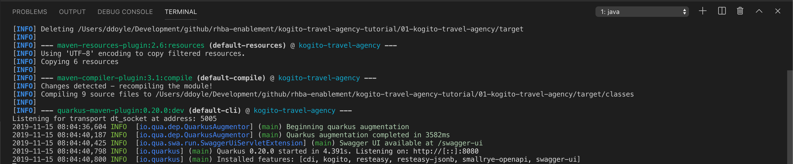
. You should now be able to access your Kogito application at: http://localhost:8080
+
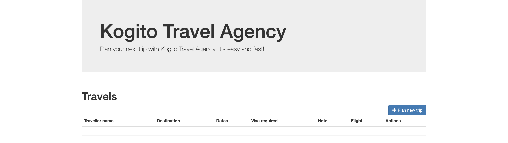
+
. We can now deploy our Kogito application to OpenShift.

== Kogito CLI & Operator: Deploying your Kogito application to OpenShift

The Kogito CLI provides an easy way to create new Kogito projects in OpenShift, deploy new Kogito services to OpenShift, etc.
The Kogito CLI relies on the OpenShift "oc client" to execute its functionality, hence it is required to have an "oc client" connected to your OpenShift cluster.

. Connect your "oc client" to your OpenShift cluster. To do this:
.. login to the OpenShift Console using your username and password.
.. Click on your username in the upper-right corner of the console and click on `Copy Login Command`:
+
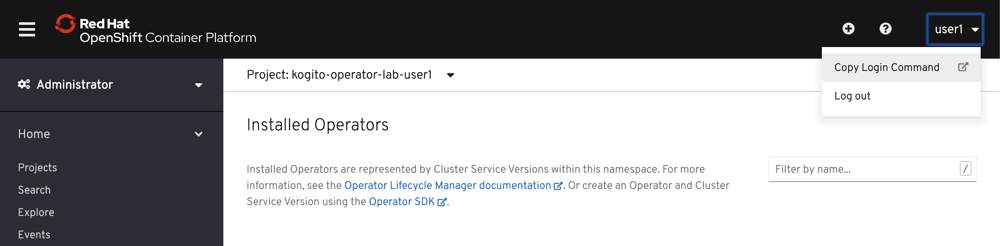
+
.. You are required to provide your credentials again.
.. Once logged in, click on `Display Token` link. This will open a window that shows the `oc` command to login with the token.
+
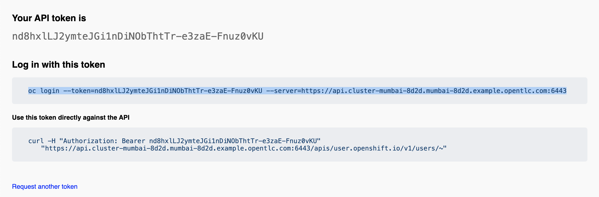
+
.. Select the `oc` login command, copy/paste it into a terminal and press enter:
+
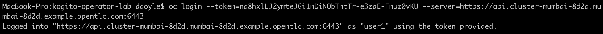

With the `oc` client connected to our cluster, we can now use the Kogito CLI client to create and deploy our Kogito project and application.

If you have the Kogito application still running locally, stop the application using _Ctrl +C_.

A Kogito project, with the Kogito Operator installed has been provided to you. The name of the project is `kogito-travel-agency-{username}`.

. Select the provided project with the Kogito client:
+
```
kogito use-project kogito-travel-agency-{username}
```
+
. With the correct project selected, we can now deploy our Kogito service.
+
```
$ kogito deploy-service kogito-travel-agency {your_kogito_travel_agency_github_repo_url} --context-dir 01-kogito-travel-agency --branch enablement
```
+
NOTE As in the previous labs, the first build can take quite some time as it's downloading a lot of Maven dependencies. Subsequent builds should be faster as they should reuse the already downloaded dependencies as part of the incremental build.
+
. Wait until the build is finished. You can follow the *builder* build with the following command:
+
```
$ oc logs -f build/kogito-travel-agency-builder-1
```
+
. When the *builder* build and *application* build have finished, the Deployment Config has been created and the Pod is up and running, retrieve the route to you Kogito Travel Agency application with the following command (you can also find the route via the OpenShift Console if you ):
+
```
$ oc get route
NAME                   HOST/PORT                                                                                             PATH   SERVICES               PORT   TERMINATION   WILDCARD
kogito-travel-agency   kogito-travel-agency-kogito-operator-lab-user1.apps.cluster-rdam-4a35.rdam-4a35.example.opentlc.com          kogito-travel-agency   http                 None
```
+
. Access the Kogito application deployed on OpenShift using your browser. You should see the same screen as the one you saw when you access the application locally.
+
image:images/kogito-advanced-travel-agency-openshift.png[]


== Testing the Application

Before we start working on our application, we want to test the application in its current form.

. In the Kogito Travel Agency application screen, click on the *+ Plan new trip* button. Use the following trip data (being _Polish_ and traveling to the _US_ is important for the VISA rules to fire).
+
image: images/kogito-advanced-plan-new-trip.png[]
+
. You will see the new travel being created.
+
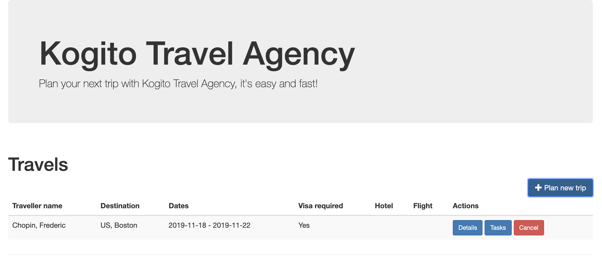

To demonstrate the lack of persistence in the current application, we will bring down the Kogito Travel Application Pod and spin it back-up again.
. Open the OpenShift Console and navigate to *Workloads -> Deployment Configs -> kogito-travel-agency*.
+
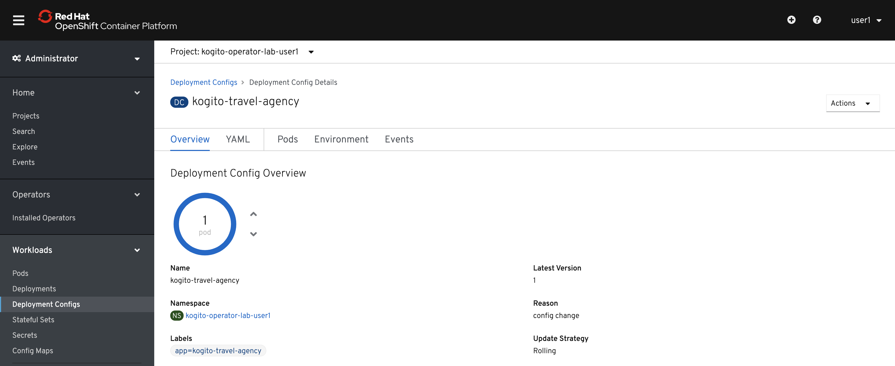
. Bring down the pod by clicking on the downward facing arrow next to the Pod widget.
. The pod will be brought down, but the reconciliation feature of the Kogito Operator will automatically spin it back up.
. When the pod is back up, refresh your browser tab of your Kogito application.

You will notice that your travel is gone. This is due to the fact that we have not configured persistence on the application, thus using in-memory persistence.
When the pod is recycled, the in-memory state is gone..

== Binary Builds

As we've seen, the builds on OpenShift 4.2 can take quite some time. To speed up the process of building and deploying to OpenShift, we will use a _binary build_.
In a _binary build_, you build your application artefacts locally, after which you push to an OpenShift BuildConfig.

. Your project contains an OpenShift template with a binary BuildConfig definition. In a terminal, go to the route of your `01-kogito-travel-agency` project and execute the following command:
+
```
$ oc process -f openshift/kogito-travel-agency-binary-build-config.yml | oc create -f - -n kogito

```

This will create a binary BuildConfig that pushes to the same ImageStream as the builds configured by the Kogito Operator.
This means that when our binary build completes, it will push its result to the `kogito-travel-agency` ImageStream, which will trigger a new deployment in the DeploymentConfig.


== Persistence

Kogito uses a pluggable persistence mechanism based on _NoSQL key-value_ stores.
By default it uses https://infinispan.org/[Infinispan] (JBoss Data Grid) as the persistence store, but it is possible to plug-in alternative persistence mechanisms.

The Kogito process/workflow engine uses a persistence store per process definition.
I.e. when your application containts multiple process definitions, it will create and use a separate store for each definition (in the case of Infinispan this means a separate cache per process defition).

To be able to use persistence in our application, we first need to deploy and Infinispan server in our environment.

. In a terminal, make sure your `oc` client is connected to your `kogito-operator-lab-{user}` project.
. Deploy an Infinispan Server 10 instance to your OpenShift project using the following command (note that this is a basic Infinispan server without security):
+
```
$ oc new-app jboss/infinispan-server:10.0.0.Beta3 -e MGMT_USER=kogito -e MGMT_PASS=kogito
```
+
. In the OpenShift Console, navigate to "Workloads -> Deployment Configs". You should see an Infinispan Server deployment with 1 pod.
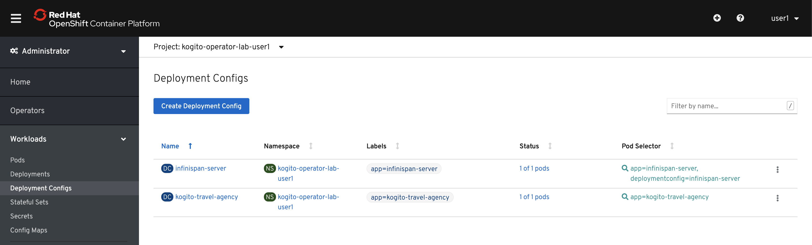

To use the Infinispan caches, we need to add the _Quarkus Infinispan Client_ and the _Kogito Infinispan Persistence Addon_ to our project.
We also need to configure the

. Add the following dependencies to your `pom.xml` file.
+
```
<dependency>
  <groupId>io.quarkus</groupId>
  <artifactId>quarkus-infinispan-client</artifactId>
</dependency>
<dependency>
  <groupId>org.kie.kogito</groupId>
  <artifactId>infinispan-persistence-addon</artifactId>
  <version>${kogito.version}</version>
</dependency>
```
+
. Add the following line to the `application.properties` configuration file in the `src/main/resources` directory. Note that `infinispan-server` is that service name of our Infinispan instance in OpenShift.
+
```
quarkus.infinispan-client.server-list=infinispan-server:11222
```

To deploy the application to OpenShift, we will use the binary build approach. I.e., we will build the application locally and push this JAR file and it's libraries to the OpenShift Binary Build we've configured earlier.
The `01-kogito-travel-agency` project contains a helper script, `startBinaryBuild.sh` for Linux and macOS that does this automatically. You can either run this script, or execute the following steps manually (which will help you understand the Kogito/Quarks application structure and how to trigger a binary build on OpenShift):

. In the `01-kogito-travel-agency` project folder, run a new Maven build.
+
```
$ mvn clean package -DskipTests
```
+
. Inspect the `target` folder of the project.
+
```
$ ls -l target
total 6496
drwxr-xr-x    7 ddoyle  staff      224 Nov 15 21:03 classes
drwxr-xr-x    4 ddoyle  staff      128 Nov 15 21:03 generated-sources
drwxr-xr-x    3 ddoyle  staff       96 Nov 15 21:03 generated-test-sources
-rw-r--r--    1 ddoyle  staff     4964 Nov 15 21:03 image_metadata.json
-rw-r--r--    1 ddoyle  staff  3287774 Nov 15 21:03 kogito-travel-agency-1.0-SNAPSHOT-runner.jar
-rw-r--r--    1 ddoyle  staff    24897 Nov 15 21:03 kogito-travel-agency-1.0-SNAPSHOT.jar
drwxr-xr-x  173 ddoyle  staff     5536 Nov 15 21:03 lib
drwxr-xr-x    3 ddoyle  staff       96 Nov 15 21:03 maven-archiver
drwxr-xr-x    3 ddoyle  staff       96 Nov 15 21:03 maven-status
drwxr-xr-x    3 ddoyle  staff       96 Nov 15 21:03 test-classes
drwxr-xr-x    2 ddoyle  staff       64 Nov 15 21:03 transformed-classes
drwxr-xr-x    6 ddoyle  staff      192 Nov 15 21:03 wiring-classes
```
+
. `kogito-travel-agency-1.0-SNAPSHOT-runner.jar` is an executable JAR file. It is however not an uber-jar as the dependencies are copied into the `target/lib` directory.
. Prepare for a binary build on OpenShift. On your workstation, create a directory /tmp/kogito-travel-agency. Copy the executable application jar and the lib folder to the directory.
+
```
$ mkdir /tmp/kogito-travel-agency
$ cp -r target/kogito-travel-agency-1.0-SNAPSHOT-runner.jar target/lib /tmp/kogito-travel-agency
```
+
. Deploy the application to OpenShift:
+
```
$ oc start-build kogito-travel-agency-binary --from-dir=/tmp/kogito-travel-agency -n kogito
Output
Uploading directory "/tmp/kogito-travel-agency-binary" as binary input for the build ...
...........
Uploading finished
build.build.openshift.io/kogito-travel-agency-binary-1 started
```
+
. Check the logs of the builder pod:
+
```
$ oc logs -f build/kogito-travel-agency-binary-1-build
```
+
. Once your binary build is finished, it will push the result to the `kogito-travel-agency` ImageStream (the ImageStream that was created by the Operator), which will trigger a new deployment.
. Navigate to *Workloads -> Deployment Configs -> kogito-travel-agency*, Observe that a new deployment is being provisioned.

We have now configured our Kogito Travel Agency application to use Infinispan persistence. To test our persistence:

. Create a new Travel using the Kogito Travel Agency application WEB-UI, or send a RESTful request using cURL, for example like this:
+
```
{
   "traveller":{
      "firstName":"Jan",
      "lastName":"Kowalski",
      "email":"jan@email.com",
      "nationality":"Polish",
      "address":{
         "street":"Polna",
         "city":"Krakow",
         "zipCode":"32-000",
         "country":"Poland"
      }
   },
   "trip":{
      "country":"US",
      "city":"New York",
      "begin":"2019-11-04T00:00:00.000+02:00",
      "end":"2019-11-07T00:00:00.000+02:00"
   }
}
```
+
. Navigate to *Workloads -> Deployment Configs -> kogito-travel-agency*.
. Bring down the running pod by clicking on the downward facing arrow next to the pod widget.
. When the pod is down, bring a new one up by clicking on the upward facing arrow next to the pod widget.
. Go back to the Kogito Travel Agency WEB-UI and observe that the data is still present.


== Deploying the infrastructure locally

From a _developer experience_ perspective, it would be great if we can simply run Kogito applications on our local system.
This means that we need to deploy the required infrastructure on our local system, i.e.:

* Infinispan: for persistence support
* Kafka: for messaging support.

. Download Infinispan Server version 10.0.1.Final from the following location: https://downloads.jboss.org/infinispan/10.0.1.Final/infinispan-server-10.0.1.Final.zip
. Unzip the Infinispan zip file:
+
```
$ unzip infinispan-server-10.0.1.Final.zip
```
+
. Go to the `bin` folder of Infinispan Server and start the server:
+
```
$ cd infinispan-server-10.0.1.Final/bin/
$ ./server.sh
```
+
. The server will boot and will display the following message:
+
```
12:34:22,206 INFO  [org.infinispan.SERVER] (main) ISPN080001: Infinispan Server 10.0.1.Final started in 4378ms
```

We can now install Kafka.

. Download Apache Kafka from the following location: https://www.apache.org/dyn/closer.cgi?path=/kafka/2.3.0/kafka_2.12-2.3.0.tgz
. Untar the archive
+
```
$ tar xvzf kafka_2.12-2.3.0.tgz
```
+
. Navigate to the Kafka directory
+
```
$  cd kafka_2.12-2.3.0/
```
+
. Start ZooKeeper:
+
```
$ ./bin/zookeeper-server-start.sh config/zookeeper.properties
```
+
. In another terminal, start the Kafka Server:
+
```
$ ./bin/kafka-server-start.sh config/server.properties
```
+

You now have the infrastructure deployed to developer and deploy your Kogito application locally.


== Running your application locally.

With the infrastructure deployed, we can now start our Kogito application, including persistence.

. In the `application.properties` file of your application, change your `infinispan-client` configuration to point to your Infinispan server running on `localhost`:
+
```
quarkus.infinispan-client.server-list=localhost:11222
```
+
. Start your Kogito application in Quarkus dev-mode. You can either do this from the integrated terminal of VSCode, or from the terminal.
+
```
$ mvn clean compile quarkus:dev
```
+
. Note that your Kogito application connects to your local Infinispan server:
+
```
2019-11-19 12:55:56,741 INFO  [org.inf.cli.hot.RemoteCacheManager] (main) ISPN004021: Infinispan version: 10.0.0.CR1
2019-11-19 12:55:56,782 INFO  [org.inf.cli.hot.imp.pro.Codec] (HotRod-client-async-pool-1-1) ISPN004006: Server sent new topology view (id=1, age=0) containing 1 addresses: [127.0.0.1:11222]
2019-11-19 12:55:56,784 INFO  [org.inf.cli.hot.imp.tra.net.ChannelFactory] (HotRod-client-async-pool-1-1) ISPN004014: New server added(127.0.0.1:11222), adding to the pool.
```
+
. Open the Kogito application in your browser at http://localhost:8080 and create a new travel.
. Open the `HotelBookingService.java` class, and change the hotel name from "Perfect hotel" into "Almost perfect hotel" (this is basically done to force a hot-reload/live-reload of the Quarkus/Kogito application)
+
```
public Hotel bookHotel(Trip trip) {
		return new Hotel("Almost perfect hotel", new Address("street", trip.getCity(), "12345", trip.getCountry()), "09876543", "XX-012345");
}
```
+
. Refresh the browser tab of your Kogito application. Note that this triggers a hot-reload/live-reload of your application:
+
```
2019-11-19 13:01:17,353 INFO  [io.qua.dev] (vert.x-worker-thread-0) Changed source files detected, recompiling [/Users/ddoyle/Development/github/rhba-enablement/kogito-travel-agency-tutorial-enablement/kogito-travel-agency-tutorial/02-kogito-travel-agency/src/main/java/org/acme/travels/service/HotelBookingService.java]
...
...
2019-11-19 13:01:17,887 INFO  [io.qua.dev] (vert.x-worker-thread-0) Hot replace total time: 0.536s
```
+
. Notice that, due to the configured Infinispan persistence, you're data is still available.


== Messaging

Kogito provides out-of-the-box integration with MicroProfile Reactive Messaging. In order to demonstrate this, we will adapt a small Kogito application to start a process using a Kafka message.

. In your forked and cloned repository, open the `kogita-visa-application`. This is an adapted version of the Visa Application app of the Travel Agency demo.
. Start the application in Quarkus dev-mode.
+
```
$ mvn clean compile quarkus:dev
```
+
. Open the application Swagger-UI in a browser tab: http://localhost:8080/swagger-ui
. Start a new application using cURL or via the Swagger API.
.. Using cURL:
+
```
curl -X POST "http://localhost:8080/visaApplications" -H "accept: application/json" -H "Content-Type: application/json" -d "{\"visaApplication\":{\"approved\":false,\"city\":\"Boston\",\"country\":\"US\",\"duration\":20,\"firstName\":\"Ayrton\",\"lastName\":\"Senna\",\"nationality\":\"Brasilian\",\"passportNumber\":\"12345678\"}}"
```
+
.. Using Swagger-UI, use the `POST /visaApplications` operation with the following body:
+
```
{
  "visaApplication": {
    "approved": false,
    "city": "Boston",
    "country": "US",
    "duration": 20,
    "firstName": "Ayrton",
    "lastName": "Senna",
    "nationality": "Brasilian",
    "passportNumber": "12345678"
  }
}
```
+
. In the Swagger-UI, execute the `GET /visaApplications` operation. Note that your application has been created.


The Kogito application exposes a RESTful endpoint that is generated from the BPMN2 definition. Kogito also provides first-class support for _event driven_ business automation.
It does this through the MicroProfile Reactive Messaging standard. To use MP ReactiveMessaging in Kogito, we use BPMN2 Message Events.

In this lab, we will add a _Start Message Event_ to our application that allows us to trigger our application from a Kafka message. We also need to create a Kafka Topic on our Kafka cluster which we can use to send messages to.

. Create a Kafka topic named `visaapplications`. In a terminal, navigate to your Kafka installation directory and execute the following command:
+
```
$ ./bin/kafka-topics.sh --create --zookeeper localhost:2181 --replication-factor 1 --partitions 1 --topic visaapplications
```
+
. Open the `ProcessVisaApplications.bpmn2` process definition.
. Add a new _Message Start Event_ to the process definition and connect it to the rest of the process. You will need to add an _Exclusive Gateway_ to model this correctly.
+
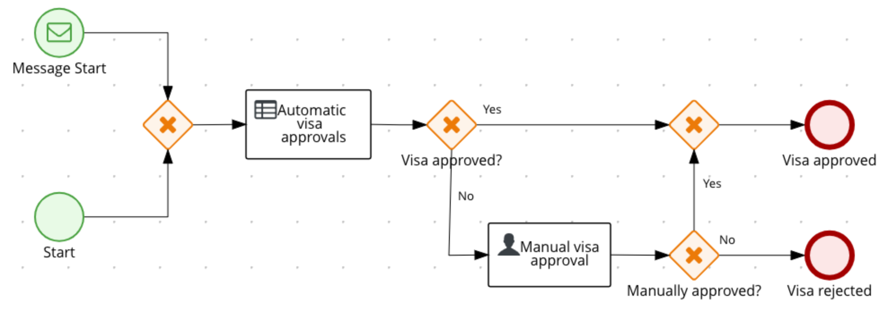
+
. With the _Message Start Event_ selected, open the property panel on the right-hand-side of the editor. Expand the *Message* section and set the *Message* field to the value `visaapplications`.
+
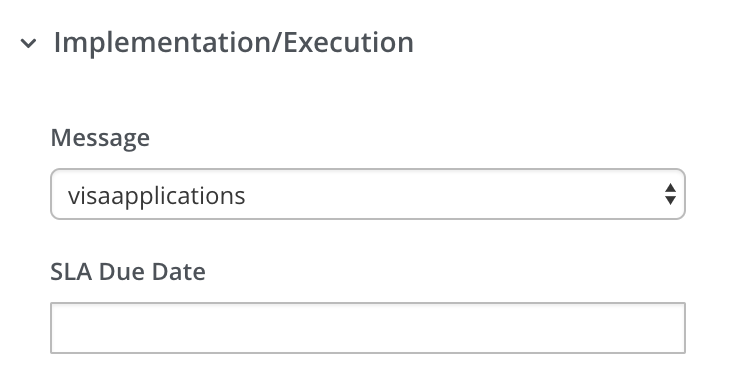
+
. In the property panel, expand the _Data Assignments_ section, click on the *Assignments* editor icon. Create a _Data Output and Assignment_ with the following values:
.. Name: `event`
.. Data Type: `org.acme.travels.VisaApplication`
.. Target: `visaApplication`
+
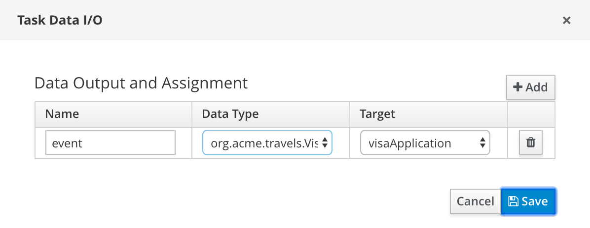

NOTE: There is a bug in the current version of the designer which causes the `structureRef` attribute of the `itemDefinition` of the message not to be set correctly.
Since the Kogito code-generators use this field to determine data-types, the project will no longer compile. We need to manually fix this in the BPMN file.

. Open the `ProcessVisaApplications.bpmn2` in the VSCode XML editor by right-clicking on the `ProcessViasApplications.bpmn2` and select _Open to the Side_.
+
image:images/kogito-advanced-editor-open-side.png[]
+
. Locate the following line. Note that the `structureRef` is not set:
+
```
<bpmn2:itemDefinition id="visaapplicationsType" structureRef=""/>

```
+
. We need to configure the `structureRef` and set it its value to `org.acme.travels.VisaApplication`:
+
```
<bpmn2:itemDefinition id="visaapplicationsType" structureRef="org.acme.travels.VisaApplication"/>
```
+
. Save the process.

We have now configured the _Message Start Event_ to ingest messages from MicroProfile Reactive Messaging. We now need to add the required dependencies to our Maven POM file.

. Open the `pom.xml` file of your project and add the following dependency.
+
```
<dependency>
  <groupId>io.quarkus</groupId>
  <artifactId>quarkus-smallrye-reactive-messaging-kafka</artifactId>
</dependency>
```

Finally, we need to configure the `application.properties` file of our Kogito application to connect to Kafka.

. Open the `application.properties` file.
. Add the following MicroProfile configuration, which will connect the `visaapplications` reactive messaging configuration that we use in our Start Event to the Kafka topic we created earlier.
+
```
mp.messaging.incoming.visaapplications.bootstrap.servers=localhost:9092
mp.messaging.incoming.visaapplications.connector=smallrye-kafka
mp.messaging.incoming.visaapplications.topic=visaapplications
mp.messaging.incoming.visaapplications.value.deserializer=org.apache.kafka.common.serialization.StringDeserializer
mp.messaging.incoming.visaapplications.auto.offset.reset=earliest
```
+
. Restart the application in Quarkus dev-mode with the following command:
+
```
$ mvn clean compile quarkus:dev
```
+
. You should see the following in the log, which shows that the Kogito application has generated a Kafka consumer:
+
```
2019-11-19 18:55:24,100 INFO  [io.sma.rea.mes.ext.MediatorManager] (main) Connecting org.acme.travels.VisaApplicationsMessageConsumer_2#consume to `visaapplications` (org.eclipse.microprofile.reactive.streams.operators.core.PublisherBuilderImpl@f288c14)
2019-11-19 18:55:24,149 INFO  [org.apa.kaf.cli.con.KafkaConsumer] (vert.x-kafka-consumer-thread-0) [Consumer clientId=consumer-1, groupId=4fc51cbf-cc3c-4c1d-9c70-06ad4c808875] Subscribed to topic(s): visaapplications
```

We can now send a JSON message to our Kafka topic. As the Message Start Event only accepts a single message, the `VisaApplication`, the JSON data we need to send looks like this:

```
{
  "approved": false,
  "city": "Boston",
  "country": "US",
  "duration": 20,
  "firstName": "Ayrton",
  "lastName": "Senna",
  "nationality": "Brasilian",
  "passportNumber": "12345678"
}
```

Note that the data is not wrapped in a `visaapplication` object anymore, like in the RESTful request.

The Reactive Messaging integration of Kogito uses the https://cloudevents.io/[Cloud Events format]. Cloud Events is a standard for describing event data in a common way.
The Cloud Event format of our VisaApplication request looks like this:

```
{
  "specversion":"0.3",
  "id":"21627e26-31eb-43e7-8343-92a696fd96b1",
  "source":"",
  "type":"TripMessageDataEvent_8",
  "time":"2019-10-01T12:02:23.812262+02:00[Europe/Warsaw]",
  "data": {
    "approved": false,
    "city": "Boston",
    "country": "US",
    "duration": 20,
    "firstName": "Ayrton",
    "lastName": "Senna",
    "nationality": "Brasilian",
    "passportNumber": "12345678"
  }
}
```


. Start the Kafka Console Producer in your ``{kafka-installation}/bin` directory with the following command:
```
kafka-console-producer.sh --broker-list localhost:9092 --topic visaapplications
```
. You should see the `>` icon in your terminal.
. Send the following message by copy-pasting this line into your terminal and hitting _enter_:
+
```
{"specversion":"0.3","id":"21627e26-31eb-43e7-8343-92a696fd96b1","source":"","type":"TripMessageDataEvent_8","time":"2019-10-01T12:02:23.812262+02:00[Europe/Warsaw]","data":{"firstName":"Anakin","lastName":"Skywalker","city":"Boston","country":"US","duration":20,"passportNumber":"12345678","nationality":"Polish","approved":false}}
```
+
. Use cURL to retrieve the list of _visa applications_. You should see one Visa Application, the one we just started via the Kafka message.
+
```
curl -X GET "http://localhost:8080/visaApplications" -H "accept: application/json"
```
+
. Add a number of Visa Applications by sending the same message a couple of times to the Kafka topic. Check that the Visa Applications get created by executing the cURL command.


== Process and Task Cloud Events

Events are first class citizens in Kogito. The runtime emits events based on the execution context of a given request.
The main aim for these events is to notify 3rd parties about changes to the process instance and its data.
To avoid too many events being sent and to optimise both producer and consumer side there will be only one event per process instance emitted.
That event will consists of relevant information such as:

* process instance metadata e.g. process id, process instance id, process instance state, etc

* node instances executed, list of all node instances that have been triggered/left during the execution

* variables - current state of variables after the execution

These events will provide complete view over the process instances being executed.

The event format follows the CloudEvents (https://cloudevents.io) specification.

Events by default are only emitted when there is at least on publisher defined. There might be many event publishers that can be used to send/publish these events into different channels etc.

Out of the box Kogito ships with an event publisher using Quarkus Reactive Messaging - which allows to send events to Kafka, AMQP, MQTT, Camel.

Another use case for events is communication between process instances. The BPMN Message Event nodes in the Kogito runtime publish and consume messages from Kafka topics.

In this lab you will explore the integration of Kogito with Kafka. We will continue using the applicatino of the previous lab.

. To enable Kogito process and task events, add the following dependency to your application's `pom.xml` file:
+
```
<dependency>
  <groupId>org.kie.kogito</groupId>
  <artifactId>kogito-events-reactive-messaging-addon</artifactId>
  <version>${kogito.version}</version>
</dependency>
```
+
. Add the following configuration to the `application.properties` file of your application. This will configure the Kafka topics to which the events will be sent:
+
```
mp.messaging.outgoing.kogito-processinstances-events.bootstrap.servers=localhost:9092
mp.messaging.outgoing.kogito-processinstances-events.connector=smallrye-kafka
mp.messaging.outgoing.kogito-processinstances-events.topic=kogito-processinstances-events
mp.messaging.outgoing.kogito-processinstances-events.value.serializer=org.apache.kafka.common.serialization.StringSerializer

mp.messaging.outgoing.kogito-usertaskinstances-events.bootstrap.servers=localhost:9092
mp.messaging.outgoing.kogito-usertaskinstances-events.connector=smallrye-kafka
mp.messaging.outgoing.kogito-usertaskinstances-events.topic=kogito-usertaskinstances-events
mp.messaging.outgoing.kogito-usertaskinstances-events.value.serializer=org.apache.kafka.common.serialization.StringSerializer
```
+
. Add the `kogito-processinstances-events` and `kogito-usertaskinstances-events` topics to your Kafka installation with the following commands:
+
```
$ ./bin/kafka-topics.sh --create --zookeeper localhost:2181 --replication-factor 1 --partitions 1 --topic kogito-processinstances-events
$ ./bin/kafka-topics.sh --create --zookeeper localhost:2181 --replication-factor 1 --partitions 1 --topic kogito-usertaskinstances-events
```
+
. Restart the application in Quarkus dev-mode with the following command:
+
```
$ mvn clean compile quarkus:dev
```

With the application running, we can now monitor the 2 Kafka topics we've just created to observer the events being emitted by the Kogito engine when we start a new Visa Application.

. Create a Kafka Console Consumer that consumes from the `kogito-processinstances-events` topic:
+
```
$ kafka-console-consumer.sh --bootstrap-server localhost:9092 --topic kogito-processinstances-events --from-beginning
```
+
. Create another Kafka Consule Consumer that consumes from the `kogito-usertaskinstances-events` topic:
+
```
$ kafka-console-consumer.sh --bootstrap-server localhost:9092 --topic kogito-usertaskinstances-events --from-beginning
```
+
. Create a new Visa Application with the following cURL command and observe the events that are being sent to the 2 event topics:
+
```
$ curl -X POST "http://localhost:8080/visaApplications" -H "accept: application/json" -H "Content-Type: application/json" -d "{\"visaApplication\":{\"approved\":false,\"city\":\"Boston\",\"country\":\"US\",\"duration\":20,\"firstName\":\"Ayrton\",\"lastName\":\"Senna\",\"nationality\":\"Brasilian\",\"passportNumber\":\"12345678\"}}"
```

When we now look at the Kafka consumer of our event topics, we can see the following data _Process Event_:

```
{
   "specversion":"0.3",
   "id":"1e153741-e332-4a3e-9811-82fbf73e870f",
   "source":"/visaApplications",
   "type":"ProcessInstanceEvent",
   "time":"2019-12-10T09:26:06.591-06:00[America/Chicago]",
   "data":{
      "id":"3cee8804-eea5-4a65-97b1-a7b1cfa7db9e",
      "parentInstanceId":null,
      "rootInstanceId":null,
      "processId":"visaApplications",
      "rootProcessId":null,
      "processName":"ProcessVisaApplications",
      "startDate":"2019-12-10T09:26:06.464-06:00",
      "endDate":null,
      "state":1,
      "nodeInstances":[
         {
            "id":"75f60ee9-e0cb-4e99-a746-fe7330eb8d3c",
            "nodeId":"7",
            "nodeDefinitionId":"UserTask_1",
            "nodeName":"Manual visa approval",
            "nodeType":"HumanTaskNode",
            "triggerTime":"2019-12-10T09:26:06.511-06:00",
            "leaveTime":null
         },
         {
            "id":"87d3077d-0fec-4012-9e36-3178ff776d10",
            "nodeId":"5",
            "nodeDefinitionId":"ExclusiveGateway_1",
            "nodeName":"Visa approved?",
            "nodeType":"Split",
            "triggerTime":"2019-12-10T09:26:06.509-06:00",
            "leaveTime":"2019-12-10T09:26:06.510-06:00"
         },
         {
            "id":"a218aa1f-2f13-4471-8407-eec5539106e0",
            "nodeId":"4",
            "nodeDefinitionId":"BusinessRuleTask_1",
            "nodeName":"Automatic visa approvals",
            "nodeType":"RuleSetNode",
            "triggerTime":"2019-12-10T09:26:06.469-06:00",
            "leaveTime":"2019-12-10T09:26:06.509-06:00"
         },
         {
            "id":"fd766119-4855-4d71-b41e-92e19314460c",
            "nodeId":"1",
            "nodeDefinitionId":"_BDBFEC7E-026B-4F26-85D9-CD505AECD8E2",
            "nodeName":"Join",
            "nodeType":"Join",
            "triggerTime":"2019-12-10T09:26:06.468-06:00",
            "leaveTime":"2019-12-10T09:26:06.469-06:00"
         },
         {
            "id":"e60f33c6-5da9-4edd-aac5-358a01bb784b",
            "nodeId":"3",
            "nodeDefinitionId":"_795A9985-6B47-4AD6-8944-CD157C62D945",
            "nodeName":"Start",
            "nodeType":"StartNode",
            "triggerTime":"2019-12-10T09:26:06.466-06:00",
            "leaveTime":"2019-12-10T09:26:06.467-06:00"
         }
      ],
      "variables":{
         "visaApplication":{
            "firstName":"Ayrton",
            "lastName":"Senna",
            "city":"Boston",
            "country":"US",
            "duration":20,
            "passportNumber":"12345678",
            "nationality":"Brasilian",
            "approved":false
         }
      },
      "error":null,
      "roles":null
   },
   "kogitoProcessinstanceId":"3cee8804-eea5-4a65-97b1-a7b1cfa7db9e",
   "kogitoParentProcessinstanceId":null,
   "kogitoRootProcessinstanceId":null,
   "kogitoProcessId":"visaApplications",
   "kogitoRootProcessId":null,
   "kogitoProcessinstanceState":"1",
   "kogitoReferenceId":null
}
```

and the following _User Task Event_:

```
{
   "specversion":"0.3",
   "id":"812a7d85-536c-463e-b6db-a083520dbe2d",
   "source":"/visaApplications",
   "type":"UserTaskInstanceEvent",
   "time":"2019-12-10T09:26:06.593-06:00[America/Chicago]",
   "data":{
      "id":"619d5bf6-5bc1-43ab-98bd-7e12da7dc8e5",
      "taskName":"Manual visa approval",
      "taskDescription":null,
      "taskPriority":"1",
      "referenceName":"ApplicationApproval",
      "startDate":"2019-12-10T09:26:06.512-06:00",
      "completeDate":null,
      "state":"Ready",
      "actualOwner":null,
      "potentialUsers":[

      ],
      "potentialGroups":[

      ],
      "excludedUsers":[

      ],
      "adminUsers":[

      ],
      "adminGroups":[

      ],
      "inputs":{
         "Skippable":"true",
         "application":{
            "firstName":"Ayrton",
            "lastName":"Senna",
            "city":"Boston",
            "country":"US",
            "duration":20,
            "passportNumber":"12345678",
            "nationality":"Brasilian",
            "approved":false
         },
         "TaskName":"ApplicationApproval",
         "NodeName":"Manual visa approval",
         "Priority":"1"
      },
      "outputs":{

      },
      "processInstanceId":"3cee8804-eea5-4a65-97b1-a7b1cfa7db9e",
      "rootProcessInstanceId":null,
      "processId":"visaApplications",
      "rootProcessId":null
   },
   "kogitoUserTaskinstanceId":"619d5bf6-5bc1-43ab-98bd-7e12da7dc8e5",
   "kogitoProcessinstanceId":"3cee8804-eea5-4a65-97b1-a7b1cfa7db9e",
   "kogitoRootProcessinstanceId":null,
   "kogitoProcessId":"visaApplications",
   "kogitoRootProcessId":null,
   "kogitoUserTaskinstanceState":"Ready"
}
```

Observe that the data event data is wrapped into a https://cloudevents.io/[Cloud Event].

These events can be consumed by the Kogito Data Index Service, which provides advanced, cross-deployment, full-text search capabilities.

== Data Index Service

Finally, we will deploy and use the Kogito Data Index Service.

The Kogito Data Index Service is a Quarkus based application that aims to capture and index data produced by one more Kogito runtime services. It consumes the events emitted by the Kogito runtime event publisher and stores and indexes them in an Infinispan cluster.

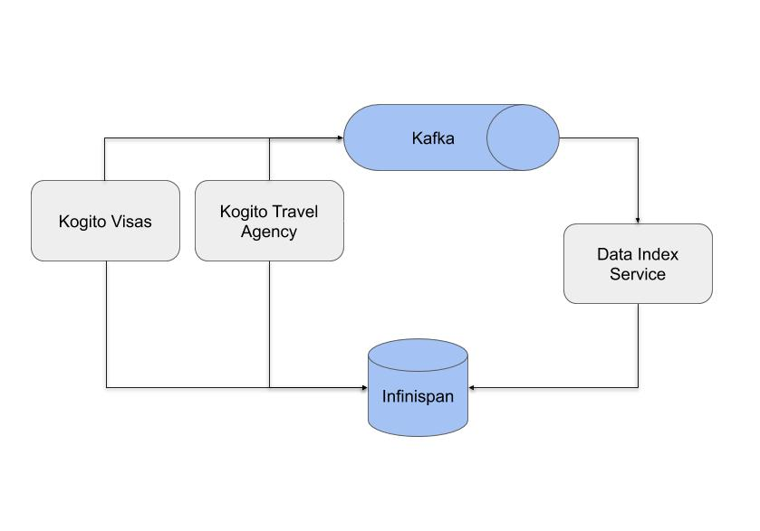

The Data Index Service is not intended to be used as permanent storage or audit log information. The focus is to make business domain data easily accessible for processes that are currently in progress.

In its current version, it uses Kakfa messaging to consume CloudEvents based messages from Kogito runtimes, process and index the information for later consumption via GraphQL queries.

The Data Index Service is capable of indexing custom process models, if it has access to the Protobuf definition files of the model.

The Data Index Service is bundled with the GraphiQL (https://github.com/graphql/graphiql) UI, which allows exploring and querying the available data model. Alternatively, it is also possible to use a GraphQL client API to communicate with the exposed GraphQL endpoint.

. In your `kogito-travel-agency-tutorial` repository, you will find the projects `06-kogito-travel-agency` and `06-kogito-visas`. If you've not already done so, import these 2 projects into your Visual Studio Code.
. Make sure that your Infinispan and Kafka instances are running.
. Add the 2 new topics to Kafka: `visasapproved` and `visasrejected`:
+
```
$ ./bin/kafka-topics.sh --create --zookeeper localhost:2181 --replication-factor 1 --partitions 1 --topic visasapproved
$ ./bin/kafka-topics.sh --create --zookeeper localhost:2181 --replication-factor 1 --partitions 1 --topic visasrejected
```
+
. Start both applications in Quarkus Dev-mode:
+
```
$ mvn clean compile quarkus:dev
```

In this demo we will be using the _Kogito Data Index Service_. Download this service from the following location: http://repo2.maven.org/maven2/org/kie/kogito/data-index-service/0.6.0/data-index-service-0.6.0-runner.jar

This service needs to be started with the 2 Protobuf files provided by our _travel agency_ and _visas_ application. These files can be found in the `target/classes/persistence` folder of both projects.

. Create a new directory called `travel-agency-proto`, anywhere on your system. In this example we will use `/tmp/travel-agency-proto` directory.
. Copy the `travels.proto` and `visaApplications.proto` files to the `/tmp/travel-agency-proto` directory.
. Start the Data Index service with the following command (if you have your `proto` files in  another directory, make sure to point to the correct directory):
+
```
$ java -jar  -Dkogito.protobuf.folder=/tmp/travel-agency-proto data-index-service-0.6.0-runner.jar
```


We now have the complete infrastructure running. We can now use our application.

. Open the Travel Agency application at: http://localhost:8080
+
image:images/kogito-advanced-travel-agency-app.png[]
+
. Create a new travel. Make sure that the _Nationality_ of your traveller is `Polish`, and that you're travelling to the `US`.
+
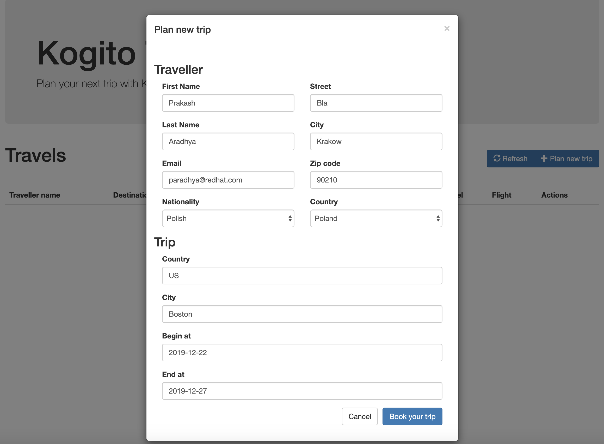
+
. You will see a new Travel instance in your application.
+
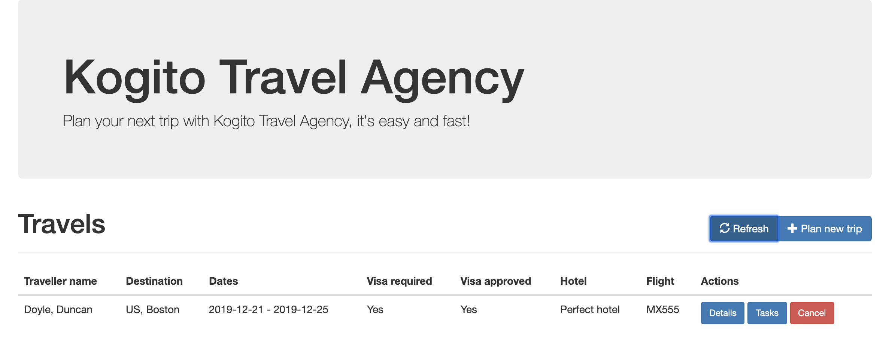
+
. Open the _Data Index Service_ at http://localhost:8180
+
image:images/kogito-advanced-data-index.png[]
+
. Run the following GraphQL query to retrieve the _ProcessInstance_ data.
+
```
{
  ProcessInstances {
    id
    processId
    processName
    start
    end
    state
  }
}
```
+
. You will see the following results:
+
```
{
  "data": {
    "ProcessInstances": [
      {
        "id": "5b48daf9-59aa-4460-b03b-dc98dab97bdf",
        "processId": "travels",
        "processName": "travels",
        "start": "2019-12-11T20:54:15.23Z",
        "end": null,
        "state": "ACTIVE"
      }
    ]
  }
}
```
+
. In the Kogito Travel application, click on the _Tasks_ button.
. Click on the _Apply_ button to apply for a Visa.
. Fill in a _Passport number_ and a _Duration_. Use the following value:
+
```
Passport number: 123456789
Duration: 40
```
+
. A new Visa Application process will have been started. Open the _Visa Application_ at http://localhost:8090
+
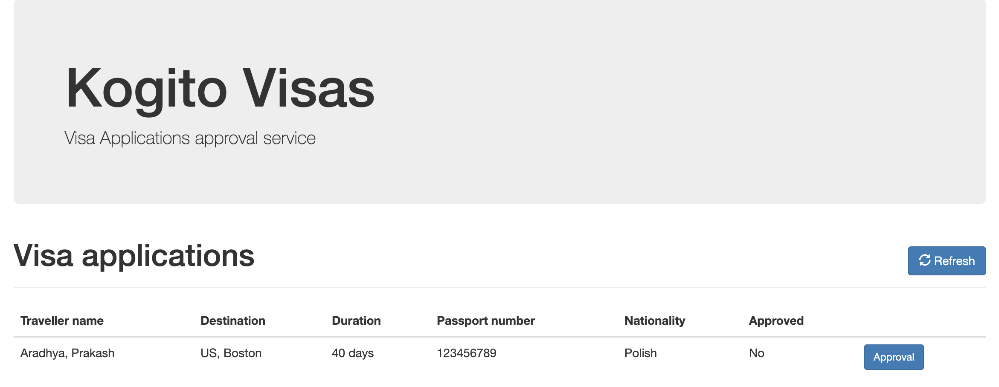
+
. Click on the `Approval` button to approve the visa. In the form, click on the `Approve` button to approve the visa application. This will send a Kafka message back to the Travel Agency process.
. Go back to the Travel Agency application. Observe that the status of the Visa application has automatically updated. This is the Data Index Service at work. The web application is registered to a GraphQL query. On a change, the new result is returned to the web application and the UI automatically refreshes.

This concludes this lab. Feel free to try some other GraphQL queries, like the `UserTaskInstances` query:
```
{
  UserTaskInstances {
    id
    name
    actualOwner
    description
    priority
    processId
    processInstanceId
  }
}

```

Or try to create some other Travels, with different data inputs and try to query for specific `ProcessInstances` or `Travels` in the GraphQL interface.

== Conclusion
This concludes the Advanced Kogito lab in which we've enabled persistence and messaging using Infinispan and Kafka.
